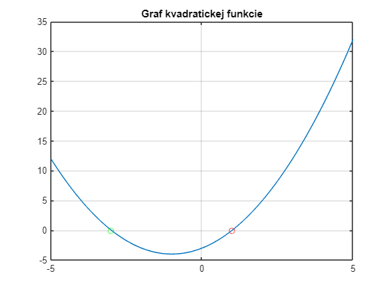
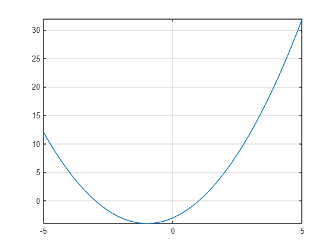

# <span style="color:rgb(213,80,0)">Quadratic equations</span>

[](https://matlab.mathworks.com/open/github/v1?repo=mblaho/QuadraticEquation)

 **Quadratic equation** is a polynomial equation of the second degree, meaning it has a term with x raised to the power of 2. **Standard form** of a quadratic equation is:

 $$ {\textrm{ax}}^2 +bx+c=0 $$ 

where *a,b,c* are real numbers and $a\not= 0$. For quadratic equations we use the following terminology:

-  ${\textrm{ax}}^2$ is **quadratic coefficient**, 
-  $\textrm{bx}$ is **linear coefficient**, 
-  $c$ is **constant coefficient** or **free term**. 

An example of a quadratic equation is $2x^2 +6x-20=0$. In this equation, quadratic coefficient is $2x^2$, linear coefficient is $6x$ and constant coefficient is $-20$. The roots of this equation are *2* and *\-5*.


**Special types of quadratic equations**:

-  If $b=0$ equation is called a **pure quadratic equation**: ${\textrm{ax}}^2 +c=0$. 
-  If $c=0$ equation is **without a free term**: ${\textrm{ax}}^2 +\textrm{bx}=0$. 
## **Solving a quadratic equation**

Every quadratic equation can be solved by calculating the **discriminant**: $D=b^2 -4\textrm{ac}$. There are 3 situations that can occur:

-  $D<0$ – there is **not a real solution**. 
-  $D=0$ – there is **one real solution** (a repeated root). 
-  $D>0$ – there are **two real solutions**. 

Solutions:

-  $\displaystyle x_1 =\frac{-b+\sqrt{D}}{2a}$ 
-  $\displaystyle x_2 =\frac{-b-\sqrt{D}}{2a}$ 
# References
1.  [**Vieme matiku**](https://www.viemematiku.sk/book/cvicenia-riesenie-kvadraticke-rovnice)
# Solving a quadratic equation in MATLAB

Using the equations above, solve the following quadratic equation:

 $$ x^2 +2x-3=0 $$ 

Equation coefficients:

```matlab
a=1;
b=2;
c=-3;
```

Discriminant:

```matlab
D=b^2-4*a*c
```

```matlabTextOutput
D = 16
```


1. Solution

```matlab
x1 = (-b+sqrt(D))/(2*a)
```

```matlabTextOutput
x1 = 1
```


2. Solution

```matlab
x2 = (-b-sqrt(D))/(2*a)
```

```matlabTextOutput
x2 = -3
```

# Plot of a quadratic function

Visualize a quadratic function using a plot

```matlab
x=-5:0.1:5;
y=a.*x.^2+b.*x+c;
plot(x,y)
hold on
grid on
plot(x1,0,'or')
plot(x2,0,'og')
hold off
title('Quadratic Function');
```

<center></center>

# Symbolic solution of a quadratic equation in MATLAB

Calculate and visualize the quadratic equation above using symbolic mathematics.

```matlab
syms x a2 b2 c2
f=a2*x^2+b2*x+c2
```
f = 
 $\displaystyle a_2 \,x^2 +b_2 \,x+c_2 $
 

```matlab
f = subs(f,[a2,b2,c2],[a,b,c])
```
f = 
 $\displaystyle x^2 +2\,x-3$
 

```matlab
fplot(f)
grid on
```

<center></center>


```matlab
solution = solve(f,x)
```
solution = 

  $$ \displaystyle \left(\begin{array}{c} -3\newline 1 \end{array}\right) $$ 
 
